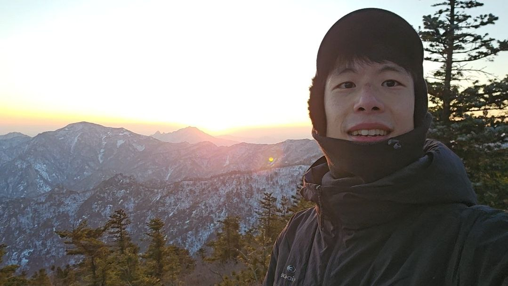
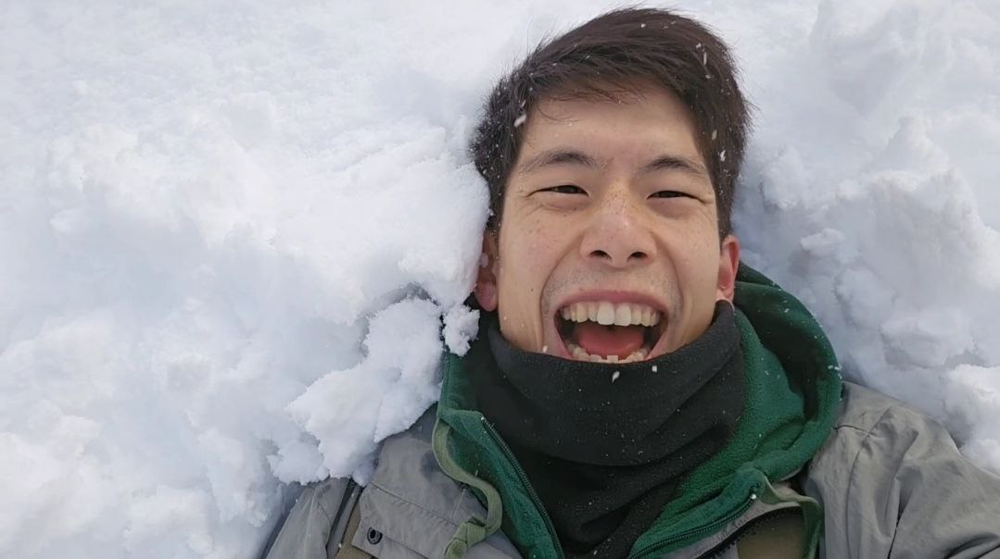

## 기본소개


| Name | Life | Email  |
| :----: | :----: | :----: |
|  조현명 | 1994 ~ | hahahihiho16@gmai.com  |


<table>
<tr><td></td>
<td></td>
<td></td></tr>
</table>

### 소개
```
웃는것을 좋아하고, 사람을 좋아합니다. 
건강하게 살며, 좋은 사람들과 많이 연결되어 살고 싶습니다.
호기심으로 삶을 배워가고 있습니다.
```

### 기술
* 수학(좋아함)
* 전기,전자(전공)
* computer science(부전공)
  * 개발(python, js, API, socket)
  * DB(sql, redis 등)
  * 서버 관리(linux, git, container, scheduler)
  * AI(ML, 통계학, AI역사, LLM 기본구조)
  * 블록체인(기본 구조, smart contract DeFi개발)
  * 암호학(전자서명, 영지식증명 흐름)
* 체력(파쿠르, 등산)
* 소통/대화방법에도 관심


## 자기설명서


**<특징>**
* 기술의 효율적 흐름을 고민하는것을 좋아합니다, 하지만 현실적인 조건도 중요하다고 생각합니다. 
* 기본적인 기술을 배워 연결하고 응용하는 것에 자신있습니다. 하지만 서비스화 된 기술을 충분히 습득하고 응용하는 대에는 시간이 걸립니다.
* 파고들어 고민하는 집중력이 있습니다. 하지만 빠르게 리서치하고 대중이 좋아하는 것을 감각하는 것은 약합니다.
* 방법들에 대해 고민하고 논의하는 것을 좋아합니다. 하지만 방향성을 정하는 것엔 시간이 걸립니다.
* 팀을 서포팅 할 때 신나는 편입니다. 하지만 주변의 반대를 무릎쓰고 추진하고 리딩하는 것은 약합니다.
* 상대의 눈높이에 맞춰 설명을 잘 합니다. 반면 전문용어로 설명하는 것엔 정리가 필요합니다.
* 건강한 것을 좋아합니다(술담배를 안합니다)


<마음에 품고 사는 말>

- 웃기위해 생각하기 - @think2smile
- 편안하기 위한 도전 - 편안함을 주는 여유를 추구하기에 모순적이게도 끊임없이 도전하는 삶을 살겠다.
- Life is not waiting for the strom to pass, it's about learning to dance in the rain


<부가적 이야기>

* 유튜브 채널이 있습니다. [띵크띵 ThinkThing](https://www.youtube.com/@think2smile)


## 이력
<details>
<summary>1994 ~ 2011(유년시절)</summary>

```
중학생때부터 수학분야에 관심이 생겨 지금까지 수학을 좋아함
```
</details>

<details>
<summary>2012 ~ 2018(대학)</summary>

```
울산과학기술원(UNIST) - 전기/전자/컴퓨터공학부(영어수업)
- 회로이론, 전자기학, 제어공학, 통신공학 등 공학공부
- 자료구조, 알고리즘, 네트워크 등 컴퓨터 공학
- 학점: 3.83/4.3

+공군(2014~2016) - 유선통신병
```
</details>

<details>
<summary>2019 (AI 교육)</summary>

```
KFQ한국품질재단 주관 - 2019.7~2019.11
- spring 으로 회원가입, mbti 테스트, 게시반, 댓글 등 백엔드+프론트엔드 개발
- python: 데이터 크롤링,데이터전처리,분석,머신러닝,딥러닝,이미지,음성처리
```
* 연습 코드(음성파일 분석, DNN 모델 학습, 음성 분리테스트)
  
  \> https://github.com/hahahihiho/proj1_sound_distinguisher
* 자료정리
  
  \> https://github.com/hahahihiho/AI-ML-DL-study  
  \> https://github.com/hahahihiho/storage
    
</details>

<details>
<summary>2020 (프론트엔드 공부)</summary>

```
보드게임기록,통계 웹앱 개발
  * 목표 : 모임 내역 기록 -> 시각화
  * 사용툴 : python: flask(웹),sqlite3(db),html,css,js,ajax(fetch)
```
\> https://github.com/hahahihiho/Boardgame-Recorder

```
리액트 공부
  * 리액트(함수형,class형) + Single Page Application + Hook Event + Redux + Redux-Thunk
  * 차트 drawing
```
\> https://github.com/hahahihiho/Learning-React
</details>

<details>
<summary>2020 ~ 2021 (Haafor Research Korea)</summary>

```
하포 리서치 코리아 - (2020.03 ~ 2021.02)

금융/퀀트 리서치, 데이터 처리, pipeline 및 시각화
  - 회사 라이브러리구축(python, django, flask, bokeh) 
  - javascript 를 이용한 대시보드(차트+interactive page) 구축 및 데이터생성,관리 
  - gitlab을 통한 코드 관리 및 배포
  - bash스크립트와 스케줄러를 이용한 배포,데이터생성 자동화
  - sql을 통한 스케줄러 db 관리
```
</details>

<details>
<summary>2021 (blockchain 교육이수)</summary>

```
한국에이아이블록체인융합원(kabc)(2021.4 ~ 2021.10) *((구)한국블록체인연구교육원) 
  - blockchain의 기본 알고리즘 및 개념(PoW, PoS, DPoS, Hash, 암호학)
  - private network(hyperledger-fabric)
    - golang, linux bash, docker-compose 등 사용
  - public network(ethereum 기반 app)
    - web3.js, ethers.js, web3.py등을 rpc를 이용
    - metamask 와 웹 연동
```
    
  - FanMOA(팬모아) - ticket cloud funding platform (https://github.com/hahahihiho/FanMOA)
    - 목표 : blockchain의 smart-contract 이용하여 소규모 공연기획(cloud funding)의 신뢰성 확보 플랫폼
    
  - 온라인 이더리움 해커톤(2021.9) 2위 수상 (주최: 디사이퍼, 수호, 토카막 네트워크)
    - NFT 생태계 이해, 블록체인 커뮤티니 경험
    - 기사(https://www.coindeskkorea.com/news/articleView.html?idxno=75419)
    - 강다르크(Kang d'Arc) (https://github.com/hahahihiho/Kang_dArc/blob/main/project-documents/NFT%20platform_travel.pdf)

  - Travel NFT - 메타디움 testnet을 이용한 NFT market (https://github.com/hahahihiho/TravelNFT)
    - 사용도구: linux, nodejs, sapper, ethers, ipfs, hardhat, solidity, metamask, metadium
    - 목표 : metamask를 이용한 여행nft 발행 및 거래

</details>

<details>
<summary>2021 ~ 2025 (CPLABS)</summary>

```
씨피랩스((구)Coinplug)) (2021.12 ~ 2025.12)

- DeFi smart contract 테스트, 개발 , 배포(solidity, nodejs, ethers, hardhat)
- 블록체인 tx 통신, 데이터 수집, 가공, 저장 및 api(js, python, sql, redis, influxDB)
- 백엔드 서버 배포 및 관리(linux, git, container)
- AI 연동, MCP, Tool, Function 개발(각종LLM API 연동, CrewAI 등)
- AI 객체인식 및 글자인식, fine tuning 및 전후처리(YOLO, PaddlePaddle 등)
```
</details>


## 자격증
- 전기기사
- 운전면허
- 컴활2급


