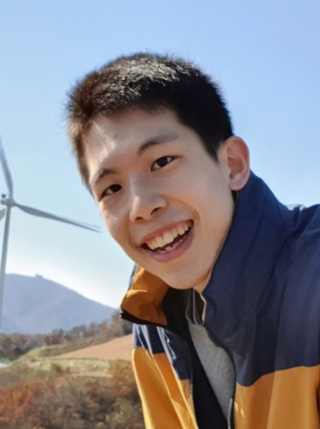
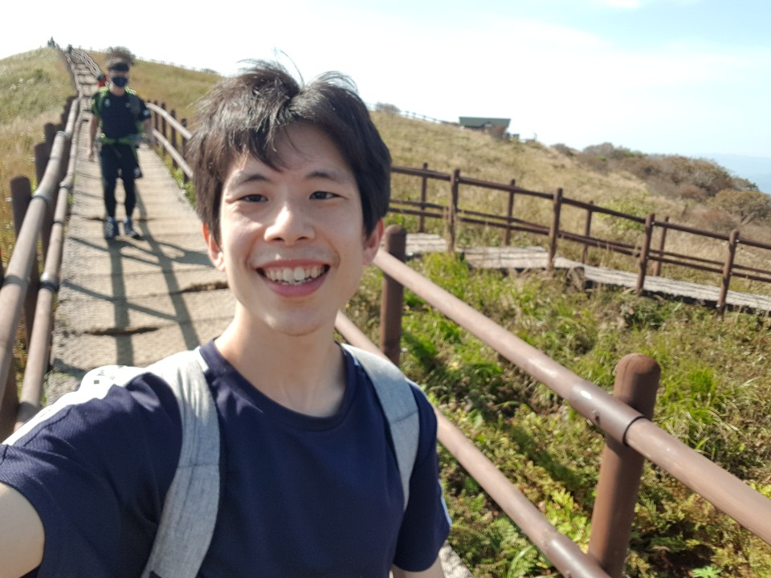
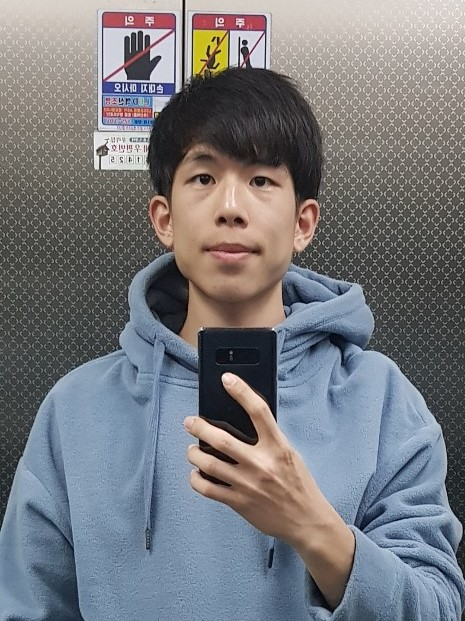

## 기본소개


| Name | Life | Email  |
| :----: | :----: | :----: |
|  조현명 | 1994 ~ | edison0106@naver.com  |


<table>
<tr><td></td>
<td></td>
<td></td></tr>
</table>

### 한줄소개

* > 저는 웃는것을 좋아하고, 배우는 것을 좋아하는 사람입니다.
  >
  > 건강하게 살며, 좋은 사람들을 많이 만나며 살고 싶습니다.
  >
  > 그러기 위해서 운동도, 공부도, 삶도 열심히 살 것 입니다.

## 관심분야(기술) .. 리스트는 늘어날 계획이라.. 평생 심심하진 않겠... 😅
* 언어, 프레임워크, tools
  * C,C++,Rust,Python,Go,javascript,typescript
  * Nodejs,Vue,React,svelte
  * flutter
* 컴퓨터
  * 네트워크, 통신
  * 보안
  * 펌웨어
  * 디버깅 - unit-test
  * 관리 - docker, kubernetes
  * 자동화(CI/CD) - jenkins, github-action
  * 빅데이터 AI
  * blockchain
    * public - bitcoin, ethereum(geth)
    * private - hyperledger(fabric/indy/sawtooth..)
    * smart contrac - solidity(assembly)
* 개인화, 자동화, 시각화
* 이론
  * 수학
  * 통계
  * 통신,네트워크
  * 알고리즘
  * 머신러닝, 딥러닝
  * 암호학
  * NLP,STT,TTS


## 활동
* 2012 ~ 2018
> * 울산과학기술원 (전기전공, 컴퓨터부전공)
>   * 1,2학년 : C++ 을 이용한 자료구조
>   * 인턴 : m-bot을 이용한 아두이노 코딩,해석학, 시스템제어 논문공부
>   * 3,4학년: 회로,네트워크 및 통신
  
* 2019
> * KFQ한국품질재단(교육이수)
>   * 로그인, 개인 성격(mbti)테스트 및 게시판 및 댓글 이용(java,spring,tomcat)
>   > https://github.com/kfq-miniproject/Psychological_Test
>   * python: 데이터 크롤링,데이터전처리,분석,머신러닝,딥러닝,이미지,음성처리
>     * 음성파일 분석, DNN 모델 학습, 음성 분리테스트
>     >  https://github.com/hahahihiho/proj1_sound_distinguisher
>     * study
>     > https://github.com/hahahihiho/AI-ML-DL-study  
>     > https://github.com/hahahihiho/storage

* 2020
> * 보드게임기록,통계 웹앱 개발
>   * python: flask(웹),sqlite3(db),html,css,js,ajax(fetch)
>   > https://github.com/hahahihiho/Boardgame-Recorder

> * 리액트 공부
>   * 리액트(함수형,class형) + Single Page Application + Hook Event + Redux + Redux-Thunk
>   * 차트 drawing
>   > https://github.com/hahahihiho/Learning-React

* 2020 ~ 2021
> * Haafor Research Korea(2020.03 ~ 2021.02)
>   * python 라이브러리(django, flask, bokeh,회사라이브러리)+javascript 를 이용한 대시보드(차트+interactive page) 구축 및 데이터생성,관리 
>   * gitlab을 통한 코드 관리 및 배포
>   * bash스크립트와 스케줄러를 이용한 배포,데이터생성 자동화
>   * sql을 통한 스케줄러 db 관리

> * 한국에이아이블록체인융합원(kabc)(2021.4 ~ 2021.10) *((구)한국블록체인연구교육원) 
>   * 이론
>     * blockchain의 기본알고리즘 및 개념(PoW, PoS, DPoS, Hash, 암호학)
>   * private network(hyperledger-fabric(v1.4)를 이용한 네트워크 구성)
>     * linux bash, docker-compose등을 이용한 자동관리
>     * golang 을 이용한 chaincode 코딩
>     * FanMOA(팬모아) - ticket cloud funding platform
>     > https://github.com/hahahihiho/FanMOA
>   * public network(ethereum 기반 app)
>     * web3.js, ethers.js, web3.py등을 rpc를 이용
>     * metamask 와 웹 연동
>     * Travel NFT - 메타디움 testnet을 이용한 NFT market(linux,nodejs,sapper,ethers,ipfs,hardhat,solidity,metamask,metadium)
>     > https://github.com/hahahihiho/TravelNFT


## 기술
   
### 공부함
* python
    ```
    * 웹 서버 : bokeh, django, flask, javascript
    * 데이터 관리, 처리, 생성, 분석 : numpy,pandas,sklearn,matplotlib
    * 이미지 분석 라이브러리 : opencv (얼굴인식)
    * 데이터 모델링 라이브러리 : tensor-flow, keras (CNN,RNN,LSTM)
    * GPU computing : CUDA (접해봄)
    * web 구현 라이브러리 : flask
    * db : sqlite3
    ```
* front-end
    ```
    * html,css : bootstrap
    * js : ajax, fetch, event-handler
    * React, Redux, Nextjs
    * Svelte, Sapper
    ```
    
* sql (CRUD)
* Data science
    ```
    * ML(Decision Tree, Random Forest, K-means, SVM)
    * DL(CNN,RNN,LSTM)
    * 통계분석(Standardization,Normalization,PCA)
    ```

* C++, java, linux
    ```
    기본문법
    ```
* Spring framework
	```
	front 부터 back-end MVC
	Project : Github - psychological Test
	```
* 수학
	```
	공업수학, 통신, 전자기학, 회로, 반도체
	```
* 금융지식
	```
	ticker, factor, PnL, exposure, position 등 주식용어
	```
* blockchian 생태계 지식
	```
	Wallet : Metamask
	DeFi : Uniswap, 1inch..
	NFT : Opensea, rarible..
	```
	
### 접해봄
* Language(Golang, R)
* Library : python library(numba)
* Cloud : AWS
* DB : Mongo DB
* tools
  * kubernetes
  * hadoop
* 딥러닝분석 `NLP,TTS,STT`
* blockchain
  * geth 


## 자기소개서

**＜기술＞** 

* 저는 수학을 좋아합니다. 그래서 수학적인 부분을 고민하는것을 좋아합니다. 
* 대학은 공대를 나왔습니다, 공학적 지식을 배웠습니다.
* 아직 접하지 못한 수많은 기술과 지식들의 확장을 좋아하기에 배우는 것에 대해서 두려움이 없습니다.

**＜능력＞**

* 새로운 것을 이해하고 배우는 속도가 빠릅니다. 확실하게 이해하고 싶은 욕심에 다양한 방향으로 고민하기에 응용하는 능력이 좋습니다.

**＜소통＞**

* 아는 것을 상대가 가진 지식에 맞추어 설명할 수 있습니다.
* 웃음이 많고 밝아서 사람을 대하는데 거리낌이 없습니다.

**＜잡설>**

바쁜 세상속에서 필요한 사람을 찾는다는건 어려운 일입니다. 글로써 자신을 표현하는 것도 어렵고, 그 글을보고 사람을 판단하는것도 어렵죠. 그래서 적절한 사람이 만난다는 건 행운이라 생각합니다. 우리는 직장을 위해, 돈을 위해, 먹고 살기위해 이력서를 쓰고, 보고 일합니다. 하지만 그것에 앞서, 모두들 아프지않고 건강하고 즐겁게 살았으면 좋겠습니다.

<특징>
* 건강한것을 좋아합니다(술담배를 안합니다)

* 운동을 좋아합니다.(자전거,등산) - 플란체를 연습중입니다..

* 제 현실(?) 모습이 궁금하다면 [띵크띵 ThinkThing](https://www.youtube.com/channel/UCglpNvBRq64IZ_ca2yBrSow) 이라는 유튜브 채널에 제 개인영상들이 있습니다.

* Curious(탐험),NVC(내면탐험) 활동 [(YouTube : Curious / Curator 3301 / 내면탐험)](https://www.youtube.com/watch?v=4OVSnEZDOms&list=PLFSh6Glh9f7tzamuBiPMrAZ7XD1Nn_xAA)


## 이력

| 다닌곳 | 특징 |
|:---: |:---:|
| 운암고 | 이과 |
| 울산과학기술원(UNIST) |  전기전자컴퓨터공학부(3.83/4.3)|
| 공군 | 유선통신병 |
| 한국품질재단(KFQ) | AI 교육 이수(딥러닝, 머신러닝) |
| Haafor Research Korea | Trading Prediction Model Research(Production,Visualization Team) |
| 한국에이아이블록체인융합원(kabc) | 블록체인 개념 및 개발 |

## 자격증
| 종류| | | |
| :---: |:---:|:---:|:---:|
| 언어 : | 토익(755)|toeic speaking (120/level 5)|toeic writing (150/level 7)|
| 나머지 : | 전기기사 |컴퓨터활용능력2급|운전면허|


