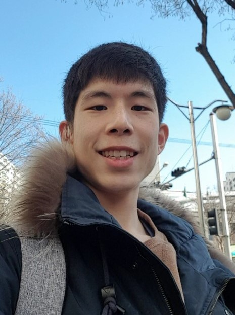

## 기본소개


| Name | Life | Email  |
| :----: | :----: | :----: |
|  조현명 | 1994 ~ | edison0106@naver.com  |


<table>
<tr><td></td>
<td></td>
<td></td></tr>
</table>

### 한줄소개

* > 저는 웃는것을 좋아하고, 배우는 것을 좋아하는 사람입니다.
  >
  > 건강하게 살며, 좋은 사람들을 많이 만나며 살고 싶습니다.
  >
  > 그러기 위해서 운동도, 공부도, 삶도 열심히 살 것 입니다.

## 관심분야(기술) .. 리스트는 늘어날 계획이라.. 평생 심심하진 않겠... 😅
* C,C++,Rust,Python,Go...
* docker, kubernetes, jenkins
* javascript(typescript),flutter,Vue,Nodejs
* 빅데이터, 통계, AI
* 개인화, 자동화, 시각화
* 네트워크, 통신
* 보안
* 펌웨어
* 수학 +
  * 알고리즘
  * 머신러닝, 딥러닝
  * 암호학
  * NLP,STT,TTS

## 활동
* 2012 ~ 2018
> * 울산과학기술원 (전기전공, 컴퓨터부전공)
>   * 1,2학년 : C++ 을 이용한 자료구조
>   * 인턴 : m-bot을 이용한 아두이노 코딩,해석학, 시스템제어 논문공부
>   * 3,4학년: 회로,네트워크 및 통신
  
* 2019
> * KFQ한국품질제단(교육이수)
>   * 로그인, 개인 성격(mbti)테스트 및 게시판 및 댓글 이용(java,spring,tomcat)
>   > https://github.com/kfq-miniproject/Psychological_Test
>   * python: 데이터 크롤링,데이터전처리,분석,머신러닝,딥러닝,이미지,음성처리
>     * 음성파일 분석, DNN 모델 학습, 음성 분리테스트
>     >  https://github.com/hahahihiho/proj1_sound_distinguisher
>     * study
>     > https://github.com/hahahihiho/AI-ML-DL-study  
>     > https://github.com/hahahihiho/storage

* 2020
> * 보드게임기록,통계 웹앱 개발
>   * python: flask(웹),sqlite3(db),html,css,js,ajax(fetch)
>   > https://github.com/hahahihiho/Boardgame-Recorder

> * 리액트 공부
>   * 리액트(함수형,class형) + Single Page Application + Hook Event + Redux + Redux-Thunk
>   * 차트 drawing
>   > https://github.com/hahahihiho/Learning-React

* 2020 ~ 2021
> * Haafor Research Korea(2020.03 ~ 2021.02)
>   * python 라이브러리(django, flask, bokeh,회사라이브러리)+javascript 를 이용한 대시보드(차트+interactive page) 구축 및 데이터생성,관리 
>   * gitlab을 통한 코드 관리 및 배포
>   * bash스크립트와 스케줄러를 이용한 배포,데이터생성 자동화
>   * sql을 통한 스케줄러 db 관리


## 기술
   
### 공부함
* python
    ```
    * 웹 서버 : bokeh, django, flask, javascript
    * 데이터 관리, 처리, 생성, 분석 : numpy,pandas,sklearn,matplotlib
    * 이미지 분석 라이브러리 : opencv (얼굴인식)
    * 데이터 모델링 라이브러리 : tensor-flow, keras (CNN,RNN,LSTM)
    * GPU computing : CUDA (접해봄)
    * web 구현 라이브러리 : flask
    * db : sqlite3
    ```
* front-end
    ```
    * html,css : bootstrap
    * js : ajax, fetch, event-handler
    ```
    
* sql (CRUD)
* React
* Data science
    ```
    * ML(Decision Tree, Random Forest, K-means, SVM)
    * DL(CNN,RNN,LSTM)
    * 통계분석(Standardization,Normalization,PCA)
    ```
* R
    ```
    * Dataframe, word-cloud
    ```
* C++, java, linux
    ```
    기본문법
    ```
* Spring framework
	```
	front 부터 back-end MVC
	Project : Github - psychological Test
	```
* 수학
	```
	공업수학, 통신, 전자기학, 회로, 반도체
	```
* 금융지식
	```
	ticker, factor, PnL, exposure, position 등 주식용어
	```
### 접해봄
* python library(numba)
* AWS
* Node.js
* Mongo DB
* docker  : `linux에 hadoop 설치후 container 배포`
* hadoop
* 딥러닝분석 `NLP,TTS,STT`


## 자기소개서

**＜기술＞** 

* 저는 수학을 좋아합니다. 그래서 수학적인 부분에 대해서는 크게 어려움 없이 습득할 수 있습니다. 
* 대학은 공대를 나왔습니다, 공학적 지식을 배웠습니다.
* 아직 접하지 못한 수많은 기술과 지식들이 있어, 그 것들을 배우는덴 시간이 걸리겠지만, 필요에 의한 확장을 좋아하기에 배우는 것에 대해서 두려움이 없습니다.

**＜능력＞**

* 문제에 대한 해결점을 찾으려고 합니다. 
* 필요한 아이디어 내는 것을 좋아합니다. (창의적입니다😅) 
* 본질을 보는 것을 좋아합니다. (사용 목적, 사용자감정, 사용된 기술) 
* 수많은 기술, 알고리즘에 익숙해질 순 있지만, 기술의 본질을 보고 잘 응용하여 다루는 기술이 더 중요하다고 생각합니다. 
* 배우는 속도는 느리지만 이해하는 속도가 빠르고, 제대로 이해한 것을 응용하는 능력이 있습니다.

**＜소통＞**

* 아는 것에 대해 빠르고 간결하게 설명하지는 못하지만, 확실히 이해한 것에 대해서 차근차근 설명하여 알려줄 수 있습니다. 
* 밝아서 사람을 대하는데 거리낌이 없습니다.

**＜잡설>**

글로써 자기를 소개한다는 건 참 어려운 일인 것 같아요. 몇 자 적는다고 그것으로 저를 표현하기는 참 어렵겠지요. 그렇다고 모든 사람을 다 만나 보고 느껴보고 아 이런 사람이구나 하기엔 참으로 바쁜 시간에, 세상엔 너무나도 많은 사람이 있죠. 그런 세상에서 사는 우리는, 결국 좋은 사람을 만난다는 건, 적절한 사람을 만난다는 건 행운이겠지요.


<무시해도 되는 목록(TMI)> 
* 도움은 안되겠지만, 감점 요소일수도 있겠지만, 누군가(?)에겐 궁금할지도 모르니 적어봅니다.

* 술담배를 안합니다

* 보드게임을 많이 해봤습니다.

* 운동을 좋아합니다.  - 플란체를 연습중입니다..

* 제 현실(?) 모습이 궁금하다면 '띵크띵 ThinkThing' 이라는 유튜브 채널에 제 개인영상들이 있습니다.

* Curious,NVC(내면탐험) 활동 (Curious 3301) 


## 이력

| 다닌곳 | 특징 |
|:---: |:---:|
| 운암고 | 이과 |
| 울산과학기술원(UNIST) |  전기전자컴퓨터공학부(3.83/4.3)|
| 공군 | 유선통신병 |
| Haafor Research Korea | Trading Prediction Model Research(Production,Visualization Team) |

## 자격증
| 종류| | | |
| :---: |:---:|:---:|:---:|
| 언어 : | 토익(755)|toeic speaking (120/level 5)|toeic writing (150/level 7)|
| 나머지 : | 전기기사 |컴퓨터활용능력2급|운전면허|


