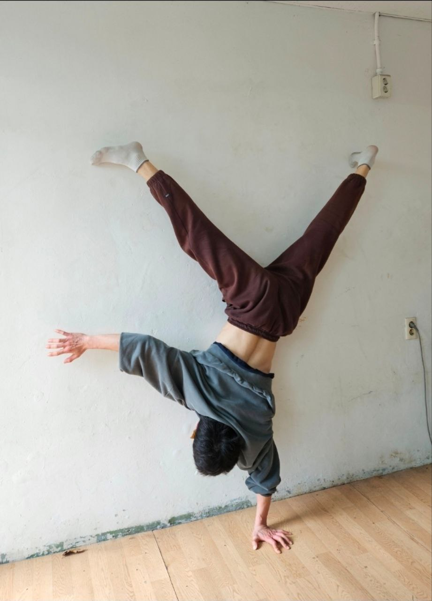

# 조현명 | 웃음과 에너지가 많은
Backend Developer | Software Engineer

📧 hahahihiho16@gmail.com  
🔗 GitHub(CV) : https://github.com/hahahihiho/resume  


<table>
<tr><td></td>
<td></td>
<td></td></tr>
</table>

```
여러분이 일을 하는 이유가 무엇인가요?
세상 사람들의 마음을 다 알 수는 없지만,
저는 즐겁기 위해서 합니다.

저는 웃음을 좋아하고, 사람을 좋아합니다.
좋은 사람들과 연결되어 도전하며, 건강하게 살고 싶습니다.
호기심으로 삶을 배워가고 있습니다.
```

## Skills
- Backend: python, js, solidity
- Data: SQL, Redis, MongoDB, InfluxDB
- Infra: Linux, Docker, RabbitMQ
- Domain: Finance, Blockchain(Ethereum), AI/ML, cryptography

## History
- UNIST(2012~2018) - 전기전자컴퓨터공학부(3.83/4.3) 
- AI 교육(2019) - web(spring), ML/AI(python)
- Frontend Study(2020) - js, React
- Haafor Research Korea(2020.3 ~ 2021.2) 
  - 금융/퀀트 데이터 처리 pipeline 구축 및 시각화
- blockchain 교육(2021) - consensus, web3, solidity, js
- CPLABS(2021.12 ~ 2025.12)
  - DeFi, 블록체인 데이터 가공, 처리, api 배포 및 관리
  - DID, zkp 신원인증 흐름 개발
  - RAG, MCP, 객체인식 및 글자인식, AI platform 개발
- 🔍 [더 자세히 보기](details/history.md)

## Additional
* 체력(맨몸운동, 등산, 파쿠르)
* 소통/대화방법에도 관심
* [마음에 품고 사는 말](additional/마음에%20품고%20사는%20말.md)
* 콘텐츠를 만듭니다  
🔗 YouTube(Vlog,일상): [띵크띵 Thinkthing](https://www.youtube.com/@think2smile)  
🔗 Instagram(Movement) [@todays.movement](https://www.instagram.com/todays.movement)  
🔗 Blog(Essay) : [이집주인](https://blog.naver.com/edison0106)


